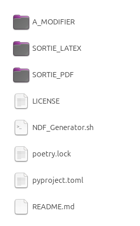
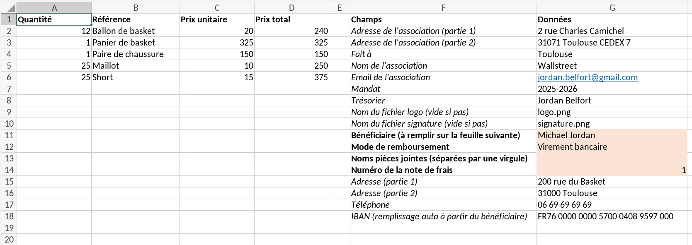
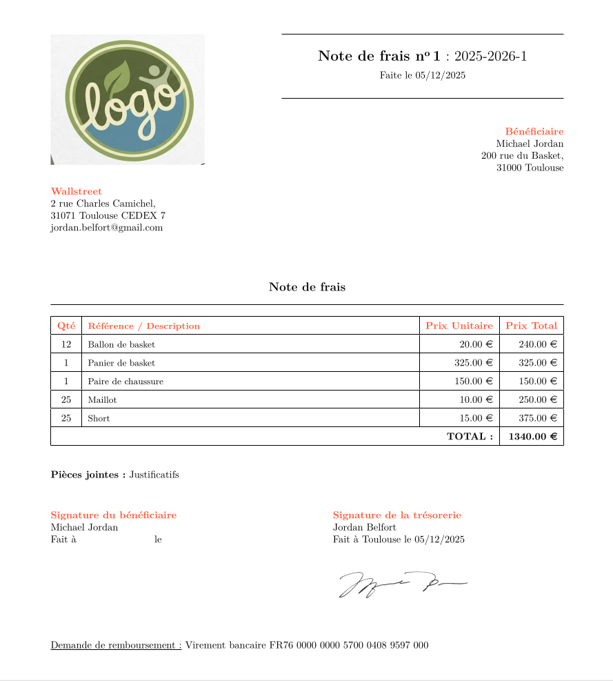

# Expense Report Creator

Créateur de notes de frais pour trésorier d'association.

## À propos

Ce projet est un script Python conçu pour exporter des données facilement modifiables et enregistrables d'un fichier xlsx en un format PDF. Le fichier intermédiaire LaTeX est aussi exporté pour modifications potentielles.

Le script est entièrement documenté en convention Google. Je me suis assuré du respect de la PEP 8 via l'utilisation d'une automatisation avec pre-commit des outils suivants :
- isort
- black
- flake8

## Installation
### Prérequis
- Python 3.12
- Curl (pour Linux et Mac/OS)
- Logiciel de lecture de fichiers xlsx (OnlyOffice par exemple)

### Configuration initiale
1. Clonez le dépôt :

    ```
    git clone https://github.com/jarvis-ed1th/expense-report-creator.git
    ```

2. Lancer une première fois le script d'export correspondant à votre système d'exploitation pour créer les dossiers de sorties et vérifier qu'il n'y a pas d'erreur :
- **Linux/MacOS** :
    - Clic droit sur `NDF_Generator.sh`
    - Cliquer sur "Exécuter" ou équivalent
- **Windows**
    - Double-clic sur `NDF_Generator.bat`

## Utilisation
### La structure
Seuls les dossiers et fichiers suivants sont utiles en tant qu'utilisateur :

- A_MODIFIER : Permet de configurer la note de frais, et d'enregistrer vos informations ainsi que celles des bénéficiaires.
- SORTIE_PDF : Toutes les notes de frais seront générées dans ce dossier
- SORTIE_LATEX : Le fichier de configuration LaTeX est, lui aussi, disponible s'il y a besoin de faire des modifications sur un éditeur comme overleaf à posteriori.
- NDF_Generator.sh : Permet de lancer la génération de la note de frais sous Linux/MacOS.

<div align="center">
	
</div>

### Documents et justificatifs
Dans le dossier A_Modifier, le trésorier pourra mettre sa signature et le logo de son association. Le dossier "justificatifs" permet de mettre toutes les preuves de paiement et autres pièces jointes qui seront ajoutées à la note de frais.

<div align="center">
	
</div>

### Modification de data.xlsx
Pour la feuille "Tableau de bord", toutes les données peuvent être modifiées pour correspondre à la situation de chacun. Il suffira ensuite de modifier pour chaque note de frais :

- Les lignes de frais à rembourser,
- Les cellules en couleur rosée.

Les bénéficiaires sont à enregistrer dans la feuille "Bénéficiaires".

<div align="center">
	
</div>

### Exemple de résultat
<div align="center">
	
</div>

## Licence

Distribué sous la licence MIT. Voir le fichier `LICENSE` pour plus d'informations.
