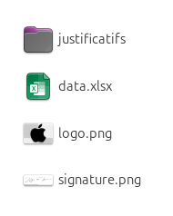
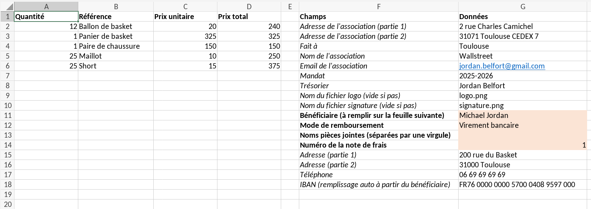
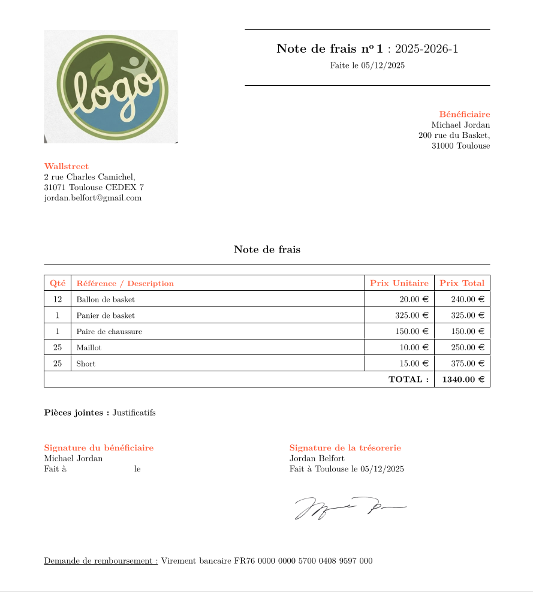

# Expense Report Creator

Générateur de notes de frais pour automatiser le travail des trésoriers au sein d'une association.

## À propos

Ce projet est un script Python conçu pour facilement créer des notes de frais à partir d'un template adapté pour les associations. Il permet d'exporter des données d'un tableau xlsx en une note de frais PDF. Le tableau xlsx fourni permet d'enregistrer facilement les informations du trésorier et de l'association, ainsi que d'enregistrer les différents bénéficiaires pour des futurs remboursements. Le fichier intermédiaire LaTeX est aussi exporté pour modifications manuelles si besoin.

Le script est entièrement documenté en convention Google. Étant adapté pour un public français, le programme est documenté dans cette langue. Cependant, il est codé en anglais pour être accessible au plus grand nombre. Je me suis assuré du respect de la PEP 8 via l'utilisation d'une automatisation avec pre-commit des outils suivants :
- isort
- black
- flake8

Le programme fonctionne sur Linux et MacOS.

## Installation
Le programme ne nécessite pas d'être installé (il fonctionne depuis github), il faut seulement installer le *gestionnaire de paquets [Nix](https://nixos.org/download/)*.

## Utilisation
1. Initialisez le fichier "TEMPLATE" (que vous pourrez renommer) avec la commande suivante. Vous pouvez vous ensuite modifier ce qu'il contient comme détaillé par la suite.

```bash
nix run github:jarvis-ed1th/expense-report-creator -- init
```

2. Pour générer la note de frais, placez-vous dans le dossier pour lancer la commande suivante.

``` bash
nix run github:jarvis-ed1th/expense-report-creator
```

3. (Optionnel) Si vous ne voulez pas vous placer dans le dossier, vous pouvez le transmettre en argument :

``` bash
nix run github:jarvis-ed1th/expense-report-creator -- /chemin/du/fichier
```

4. Vos notes de frais sont proprement générées en PDF et en LATEX dans le cas où vous souhaiteriez les modifier par la suite.

### Documents et justificatifs
Dans le dossier, le trésorier pourra mettre sa signature et le logo de son association. Le dossier "justificatifs" permet de mettre toutes les preuves de paiement et autres pièces jointes qui seront ajoutées à la note de frais.

<div align="center">
	
</div>

### Modification de data.xlsx
Pour la feuille "Tableau de bord", toutes les données peuvent être modifiées pour correspondre à la situation de chacun. Il suffira ensuite de modifier pour chaque note de frais :

- Les lignes de frais à rembourser,
- Les cellules en couleur rosée.

Les bénéficiaires sont à enregistrer dans la feuille "Bénéficiaires".

<div align="center">
	
</div>

### Génération de la note de frais

Pour générer la note de frais, il suffit alors de lancer la commande d'export correspondant à son système d'exploitation, exactement comme lors de la [seconde étape de l'utilisation.](#Utilisation)

### Exemple de note de frais
<div align="center">
	
</div>

## Licence

Distribué sous la licence MIT. Voir le fichier `LICENSE` pour plus d'informations.
